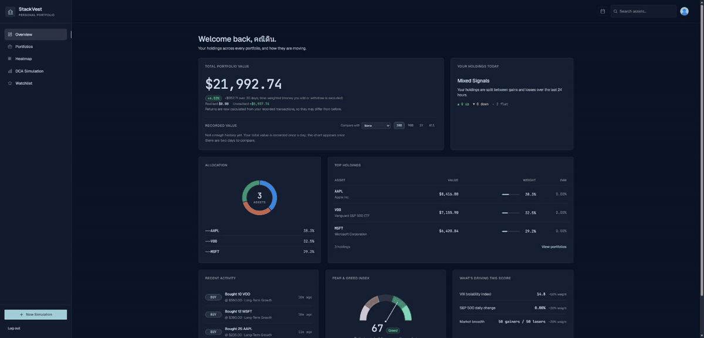

# 📈 StackVest 

**StackVest** is a personal, non-commercial investment tracking dashboard. It is a "learning-first" project designed to master a modern full-stack architecture using **Go** and **React**.

The goal is to provide a clean, visual representation of asset distribution (via Heat Maps) and backtest investing plans on historical prices through a DCA (Dollar Cost Averaging) simulator.

**🔗 [Live demo](https://stackvest.app/)**



---

## ✨ Features

- **Overview dashboard:** total portfolio value, allocation, top holdings, recent activity, and a Fear & Greed Index gauge with the signals behind the score.
- **Portfolios:** multiple named portfolios backed by a buy/sell transaction ledger, with derived positions, realised and unrealised P&L, and time-weighted returns.
- **AI strategy analysis:** a streamed analysis of a portfolio with scored dimensions such as diversification, risk, and growth potential.
- **Market heatmap:** a market-cap treemap of the S&P 500, Nasdaq 100 or Dow 30, grouped by sector and coloured by 1D/1W/1M/YTD change, plus watchlist heatmap tiles, a sparkline list, performance bars, and a multi-asset compare chart.
- **DCA simulator:** backtest dollar-cost averaging on historical prices for one asset or your holdings, with ROI, yearly returns, and a lump-sum comparison.
- **Watchlist:** track symbols with price, 24h change, 7-day trend, and per-symbol price alerts.
- **Dividend calendar:** past and upcoming payouts for your holdings, month by month.
- **Asset search:** global search with a company profile and price chart.

---

## 🛠 Tech Stack

- **Frontend:** React + Vite (Fast, modern, and lightweight).
- **Backend:** Go + Gin (High-performance API handling).
- **Authentication:** Google OAuth2.
- **Data Visualization:** Heat Maps for portfolio health.
- **Language Focus:** Exploring Go (Goroutines/Concurrency) and React Hooks.

---

## 🏗 Project Structure

This repository uses **Git Submodules** to keep the frontend and backend concerns separated while maintaining a consolidated documentation hub.

- `/frontend` → [Stack-Vest-Frontend](https://github.com/kkanitin/stack-vest-frontend) (React + Vite)
- `/backend`  → [Stack-Vest-Backend](https://github.com/kkanitin/stack-vest-backend) (Go + Gin)

---

## 🚀 Getting Started

### Prerequisites
- [Go](https://go.dev/) (1.27+)
- [Node.js](https://nodejs.org/) (22.12+)
- [Git](https://git-scm.com/)

### Installation

1. **Clone the repository with submodules:**
   ```bash
   git clone --recursive https://github.com/kkanitin/StackVest.git
   cd StackVest
   ```

2. **Run each side** by following its own README, which holds all setup and run commands:
   - [Backend](https://github.com/kkanitin/stack-vest-backend#getting-started) (start this first)
   - [Frontend](https://github.com/kkanitin/stack-vest-frontend#getting-started)

---

### 🔮 Future

This is a learning-driven project, so fair warning: I get curious, and curiosity tends to become commits. New features may appear whenever something catches my eye — nothing's off the table.
